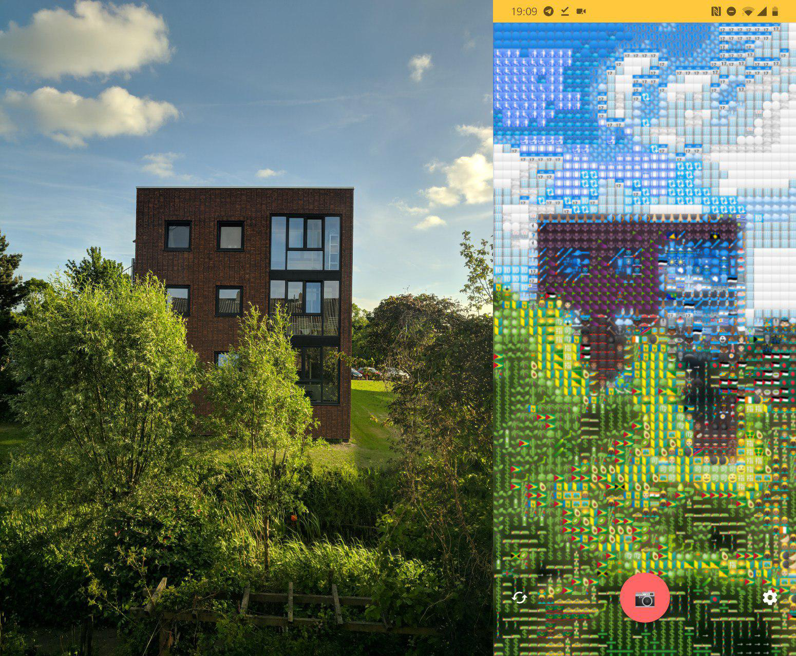
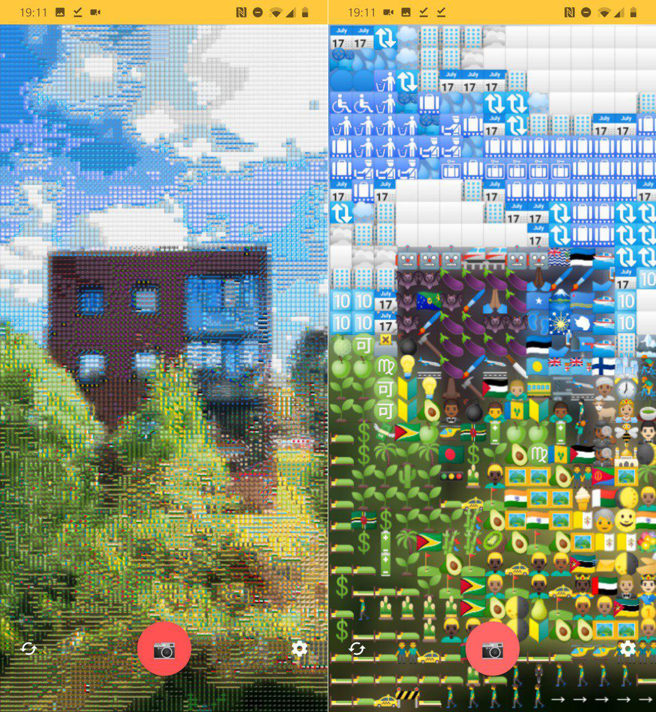
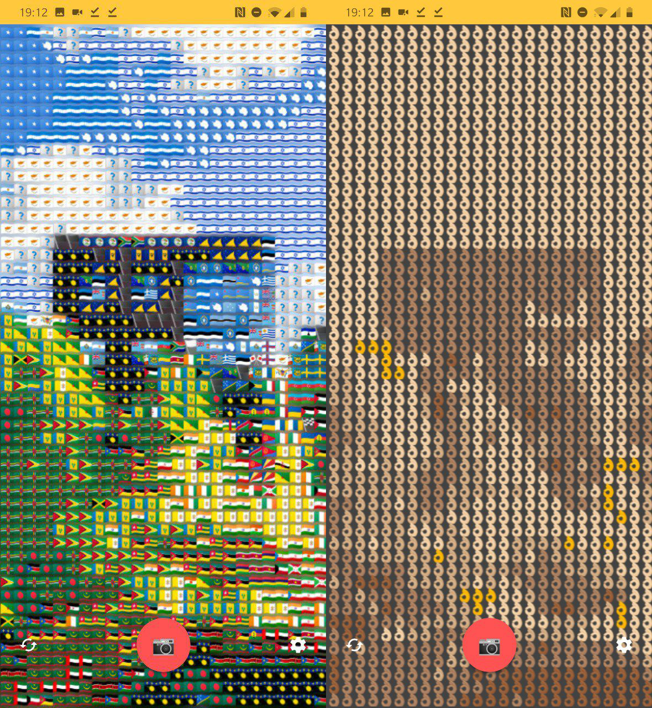

# Emoji Picture
The core algorithm turns the pixels of an image into emojis, by matching the average emoji color (in LAB color space) to the pixel color. The color comparison is done with delta E* color comparison https://www.wikiwand.com/en/Color_difference#/CIELAB_%CE%94E*. 
This algorithm is applied to a camera app. Every frame the pixels are turned into emojis, at a resolution of about 40x80 emojis this can be done with about 60 fps on my Oneplus 6T. 

## Example
### No emoji vs emoji
Regular image (left) and emoji camera (right)

### Resolution
Resolution is expressed as a single number, which indicates the amount of emojis in the x-axis. A resolution of 20 means the emoji image resolution is 20x40 (on a 18:9 aspect ratio).

### Emoji palette
The emojis used can be restricted, in the below image only flags are used (left) or only ok hands (right).



## Project setup
```
npm install
```

### Customize configuration
See [Configuration Reference](https://cli.vuejs.org/config/).
